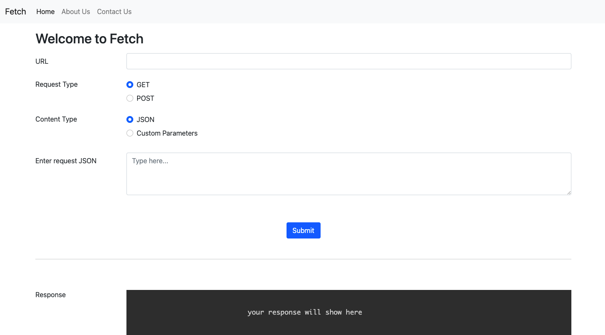

# Fetch

## Description
This is an web application which helps to make GET request and POST request to API. Using fetch saves time of making request programmatically. If api is working fine fetch also shows the result that came after calling API
## Terms & Conditions
1. Of course, all of the code is there and nothing is hidden from you so if you would like to make any other styling changes, feel free!
2. No need to give any credit
4. you can not sell this project

## Contribution
Pull requests are welcome. For major changes, please open an issue first to discuss what you would like to change.

## Contact me
Website: [https://yashsharma.netlify.app/](https://yashsharma.netlify.app/)

Email: yashsharma2572@gmail.com

Instagram: [yashsharma_f](https://www.instagram.com/yashsharma_f/)

Linkedin: [Yash sharma](https://www.linkedin.com/in/yash-sharma-4276b61b5/)
